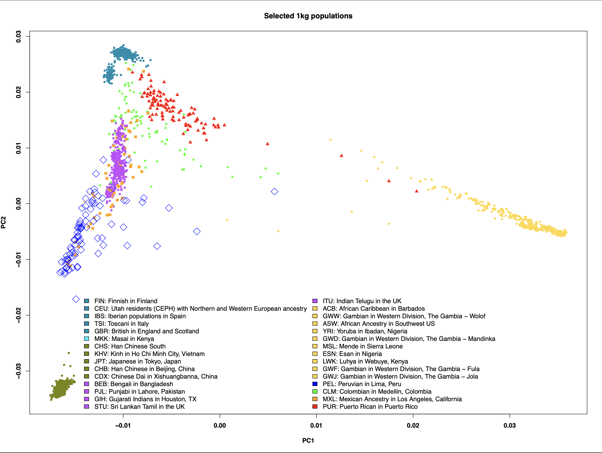

# A PCA bi-plot of 1000genomes data

We plot PC1 vs PC2 on a subset of all 30 populations with IGSR population codes. All populations are limited to 100 individuals, except for
possibly-relevant populations PEL, CLM, MXL and PUR, which are unlimited. https://1000genomes.org

## Results

### Subset of 1kg populations plotted with "Maria" and "Wawita" [Korotkov 2019](https://www.amazon.ca/Mysterious-Mummies-Nazca-Eyewitness-Testimony/dp/1075152356)


### All 1kg populations, max 100 individuals per population.

We include all IGSR-labelled populations, subsetted to a max of 100 individuals per population except for our special populations where all individuals are included. These special populations are highlighted in this chart by unique point colour and shape.

The four special populations are: PEL (Peruvian in Lima, Peru); CLM (Colombian in Medellin, Colombia); MXL (Mexican Ancestry in Los Angeles, California) and PUR (Puerto Rican in Puerto Rico).



## Data

The following data files are in this repo.

- [20130606_g1k.ped](./20130606_g1k.ped)
- [igsr_populations.tsv](./igsr_populations.tsv) # download the IGSR populations list from https://www.internationalgenome.org/data-portal/population and click on "download this list" to a file called "igsr_populations.tsv". This will be used as a reference for population names and colours.
- [plink.eigenval](./plink.eigenval)
- [plink.eigenvect](./plink.eigenvect)

If you would like to reproduce the 1kg analysis that produced these data files, my steps are below, where I basically followed Kevin Blighe's excellent tutorial here:

https://www.biostars.org/p/335605/

```
 cd /working/1000genomes
 prefix="ftp://ftp.1000genomes.ebi.ac.uk/vol1/ftp/release/20130502/ALL.chr" ;

suffix=".phase3_shapeit2_mvncall_integrated_v5b.20130502.genotypes.vcf.gz" ;

for chr in {1..22};    wget "${prefix}""${chr}""${suffix}" "${prefix}""${chr}""${suffix}".tbi ;
done

 wget ftp://ftp.1000genomes.ebi.ac.uk/vol1/ftp/technical/working/20130606_sample_info/20130606_g1k.ped ;
 wget ftp://ftp.1000genomes.ebi.ac.uk/vol1/ftp/technical/reference/human_g1k_v37.fasta.gz ;
 wget ftp://ftp.1000genomes.ebi.ac.uk/vol1/ftp/technical/reference/human_g1k_v37.fasta.fai ;


# # I had to reindex the fasta for whatever reason
samtools faidx human_g1k_v37.fasta.gz

 for chr in {1..22}; do
    bcftools norm -m-any --check-ref w --threads 16 -f human_g1k_v37.fasta.gz \
      ALL.chr"${chr}".phase3_shapeit2_mvncall_integrated_v5b.20130502.genotypes.vcf.gz | \
      bcftools annotate --threads 16 -x ID -I +'%CHROM:%POS:%REF:%ALT' | \
        bcftools norm --threads 16 -Ob --rm-dup both | \
        bcftools view --threads 16 -Ob -o ALL.chr"${chr}".phase3_shapeit2_mvncall_integrated_v5b.20130502.genotypes.bcf ;

    bcftools index --threads 16 ALL.chr"${chr}".phase3_shapeit2_mvncall_integrated_v5b.20130502.genotypes.bcf ;
done

for chr in {1..22}; do
    plink --noweb \
      --bcf ALL.chr"${chr}".phase3_shapeit2_mvncall_integrated_v5b.20130502.genotypes.bcf \
      --keep-allele-order \
      --vcf-idspace-to _ \
      --const-fid \
      --allow-extra-chr 0 \
      --split-x b37 no-fail \
      --make-bed \
      --out ALL.chr"${chr}".phase3_shapeit2_mvncall_integrated_v5b.20130502.genotypes ;
done

mkdir Pruned ;

for chr in {1..22}; do
    plink --noweb \
      --bfile ALL.chr"${chr}".phase3_shapeit2_mvncall_integrated_v5b.20130502.genotypes \
      --maf 0.10 --indep 50 5 1.5 \
      --out Pruned/ALL.chr"${chr}".phase3_shapeit2_mvncall_integrated_v5b.20130502.genotypes ;

    plink --noweb \
      --bfile ALL.chr"${chr}".phase3_shapeit2_mvncall_integrated_v5b.20130502.genotypes \
      --extract Pruned/ALL.chr"${chr}".phase3_shapeit2_mvncall_integrated_v5b.20130502.genotypes.prune.in \
      --make-bed \
      --out Pruned/ALL.chr"${chr}".phase3_shapeit2_mvncall_integrated_v5b.20130502.genotypes ;
done

find . -name "*.bim" | grep -e "Pruned" > ForMerge.list ;
sed -i 's/.bim//g' ForMerge.list ;

plink --merge-list ForMerge.list --out Merge ;
plink --bfile Merge --pca
```

The R script to produce an analysis plot can be found at [1kgPCA.R](./1kgPCA.R).
 - VerbalCant
